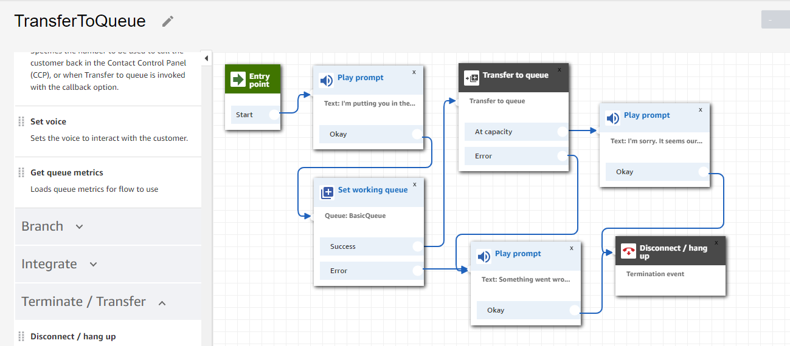
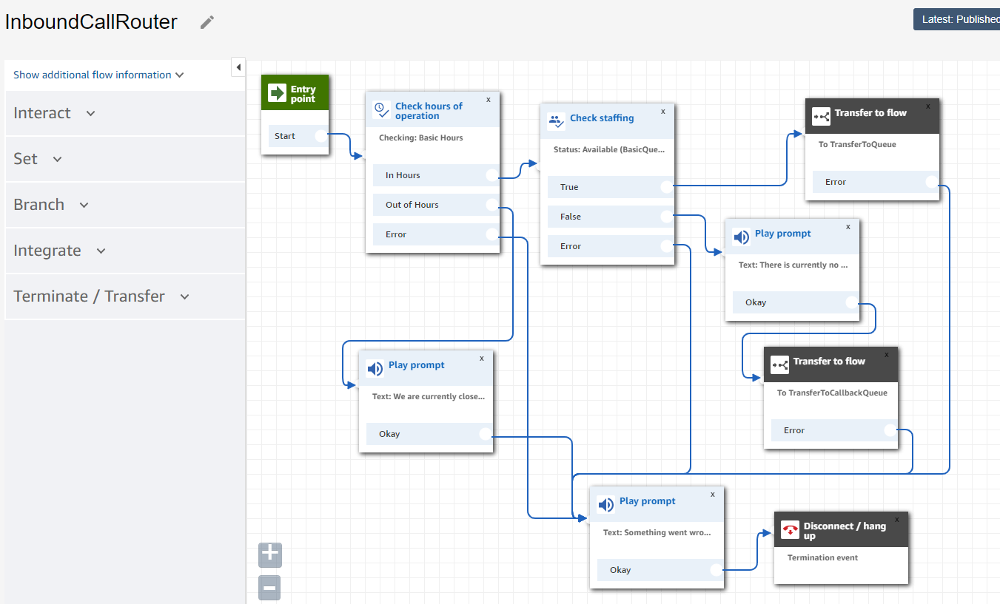
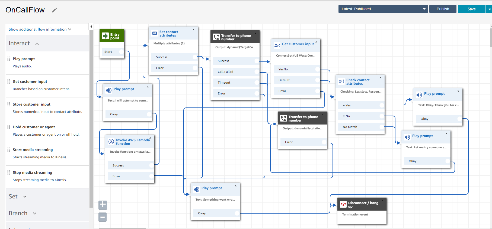
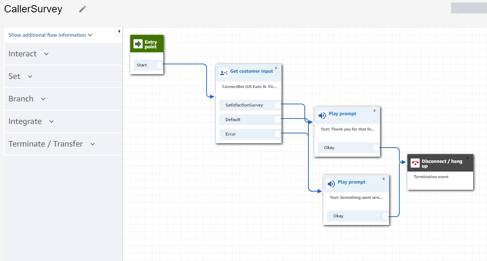
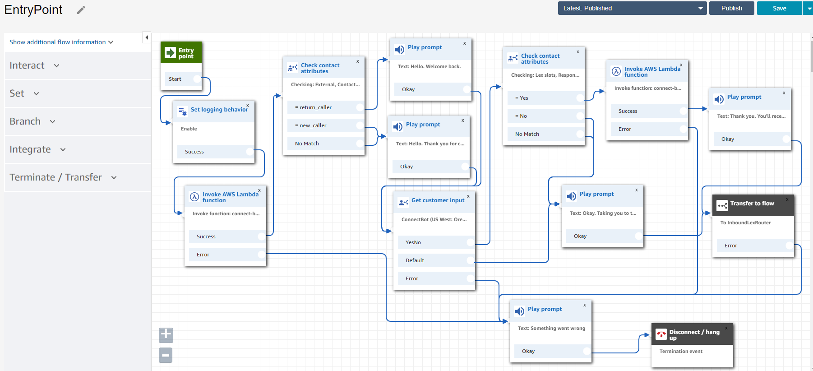

# Building a Modern Contact Center with Amazon Connect

## What are we going to build?
Create a contact center that has the following functionality:
1. If a phone number has called before say "welcome back", if not, greet the caller.
2. Ask the person if they would like to be called back later to respond to a survey after the call.
3. Using their voice to choose, give them the option of waiting on hold, being called back later, or connected to the emergency line.
4. If they choose to wait, check to see if it is in the hours of operation and if anyone is available. If no one is currently available, put the caller in the callback queue.
5. If they select the callback queue, place the customer in a callback queue.
6. If they are connected to the emergency line, look up who is on call and connect the customer to that person.  If they're unable to connect, reach out to someone else.
7. If the person choose to answer the survey, call the person back to answer a satisfaction survey.

## Prepare the Environment (if not already done)

### Launch an Amazon Connect instance
1. Log into the console.
2. Navigate to the Amazon Connect service page.
3. Select Add an instance
4. For identity management, choose Store users within Amazon Connect and enter a unique url to serve as an access point for your Contact center. Click Next.
   1. For production applications, it may make more sense to integrate with an existing directory, but for the purposes of today, let's use the built in user management capabilities.
5. For Create an Administrator page, add an admin identity.  You can use your IAM user to authenticate as an admin into the instance if you do not create a separate entity. Click Next.
6. For Telephony Options, make sure both incoming and outbound calls are selected. Click Next.
7. For Data storage, leave the default settings. Click Next.
8. Review and Create the instance.
9. Once the instance is created, select Get Started.

### Launch an Amazon Lex Bot
1. Import a Chat Bot
2. Open the Amazon Lex console.
3. Cancel out of the default getting started page.
4. Under Actions, select Import.
5. Upload the ConnectBot.zip file.
6. Click into the newly created bot and select Build.
7. Publish the bot as ConnectBot.

### Launch a the serverless backend
1.	Go to the CloudFormation service and launch a stack.
2.	Select Template is ready and upload the full-template.yml file in this repo.
3.	Name the stack and add the following information from your Connect instance into the parameters:
   - UserPhoneNumber = your phone number
4.	Keep the other settings as default.
5.	Accept the Capabilities and transforms conditions and Create Stack.
6.	What does this create for you?
   - ContactHistoryTable: A DynamoDB table that will let you track who calls and the last time they called.
   - ContactLookupLambda: A Lambda function that when given CustomerNumber as a parameter (when invoked from Connect) will look up the number in your table and return whether they are a new_caller or return_caller via attribute ContactStatus.
   - ContactRouterLambda: A Lambda function that will return a primary contact and escalation contact (your phone number) via attributes TargetContact and EscalationContact.
   - OutboundDialQueue: An SQS Queue that stores people queued for an automated outbound contact.
   - PutContactinQueueLambda: A Lambda function that puts a contact in the outbound dial queue when given CustomerNumber as a parameter from Connect.
   - InitiateOutboundDialLambda: A Lambda function that uses the SQS Queue to trigger an automated outbound dial.
   - Relevant IAM roles and policies

### Give Amazon Connect permission to call resources
1. Navigate to the Amazon Connect service.
2. Select the Amazon Connect instance created earlier.
3. Select Contact flows from the menu on the left.
4. Under the Amazon Lex section, select and add the Amazon Lex bot that was imported.
5. Under the AWS Lambda section, select and add the Lambda functions created by the Cloudformation template.
   - ContactLookupLambda
   - ContactRouterLambda
   - InitiateOutboundDialLambda

# Getting Started with Amazon Connect

1. Access the instance.
   1. Navigate to the Amazon Connect access URL
   2. Connect with the Username and Password for the admin account.
2. Once you&#39;ve entered the Amazon Connect application, select &quot;Let&#39;s go&quot;.
3. Claim your phone number. Select a US (+1) Direct Dial number and click Next.
4. You can port your own US phone number to Amazon Connect if you&#39;d like to replace existing phone numbers.
5. Wait a minute or so.  Meanwhile, let&#39;s review user management, queues, and routing profiles.
6. Give yourself a call! Amazon Connect comes with a number of example contact flows to demonstrate different functionalities.
7.  Test them out.

## Queues, Callbacks, and Hours of Operation

### Create your first Contact Flow

1. Under Routing, select Contact Flows.
2. Select create contact flow.
3. Enter the name TransferToQueue.
4. Under Interact, add a Play prompt module and link it to Entry point.
5. Click into the module, select Text to speech and enter the text &quot;I&#39;m putting you in the queue&quot;.
6. Under Set, add a Set working queue module and link it to the Play prompt module.
7. Click into the module and select the BasicQueue.
8. Under Terminate/Transfer add a Transfer to Queue module and link it to the Success option of the Set working queue module.
9. Add two more Play prompt modules. Make one say &quot;Something went wrong. Try again later&quot; and the other &quot;I&#39;m sorry. It seems our queue is at capacity. Try again later&quot;.
10. Link the error message to the Error options on set working queue, Transfer to Queue, and the at capacity message.
11. Under Terminate/Transfer, add a Disconnect/Hang up module and link your final messages to it.
12. Save and then publish.

### Test it out!

1. Under phone numbers, select the number you&#39;ve claimed.
2. Under Contact flow / IVR, select the TransferToQueue contact flow you just created and save.
3. Open up the CCP by clicking the phone icon in the upper right hand corner.

1. Wait a few moments and give yourself a call.
2. Notice that when a customer is put into a queue, they are really put into the Default customer queue.  If you want to change the experience, you can.  You can also build things like interruptible queue flows.  Similarly, the agent (you) heard the Default agent whisper.  Whispers are used to share information to only one side of the conversation.

### Creating a Callback Contact Flow – Import a Contact Flow

1. Under Routing, select Contact Flows.
2. Select create contact flow.
3. In the upper right next to the Save button, select Import flow (beta).
4. Upload the TransferToCallbackQueue file from the contact-flows folder in the repository.
5. Modify the Set working queue module to select the BasicQueue and save.
6. Click through the modules to understand how the pieces work together.
7. Save, Publish, and test the TransferToCallbackQueue contact flow like your TransferToQueue contact flow.  Notice that when connected using the callback queue, the caller heard the Default outbound contact flow.

### Using Hours of Operation

1. Under Routing, select Contact Flows.
2. Select create contact flow.
3. Enter the name InboundCallRouter.
4. Under Branch, select Check hours of operation. Select Basic Hours.
5. Build out the Error flow with error message and termination.
6. Under Branch, select Check staffing. Under Status to check, select Available. Optionally select the basic queue. Link this module to Check hours of operation&#39;s In Hours module. Link the error option.
7. Under Terminate/Transfer, select Transfer to flow. Select your TransferToQueue contact flow and save. Link this to the True output of Check Staffing and the error path.
8. Add a Play prompt module that says &quot;There is currently no one ready to accept your call.  Let me put you in the callback queue so you don&#39;t have to wait on hold&quot; and link this to the False output of Check Staffing.
9. Under Terminate/Transfer, select Transfer to flow. Select your TransferToCallbackQueue contact flow and save. Link this to your prompt and the error path.
10. Add a Play prompt module that says &quot;We are currently closed.  Please call again later.&quot;  Link this to the Out of Hours option and terminate.
11. Save, Publish, and Update your phone number&#39;s Contact Flow.
12. Now you can test how the caller is routed when you are Available or Unavailable in the CCP. Similarly, if you can change the Basic Hours of operation to see how users are routed.

# Building On the Basics

## Integrating AWS Lambda and External Transfers

### Building an On Call Contact Flow

1. Create a contact flow and Import the OnCallFlow from the contact-flows folder.
2. Update the Invoke AWS Lambda function module to call a lambda function that looks like ContactRouterLambda and save the module
3. Update the Get customer input module to select the Lex bot in the account and save.
4. Save, Publish, and test the OnCallFlow contact flow like your TransferToQueue contact flow.  The Lambda function we&#39;re invoking is picking up two contacts from a backend system and using that to dynamically route to another individual.  Look at the ContactRouterLambda to see how we do that.

### Using Amazon Lex as a Conversational Router

1. Create a new contact flow called InboundLexRouter.
2. Under Interact, add a Get customer input module. Add a Text to speech prompt. &quot;Would you like to wait on hold or be called back later when we are ready to serve you?&quot; Select Amazon Lex and the ConnectBot in the account. Add WaitOnHold, CallBack, and Emergency as Intents.
3. Create an error flow.
4. Under Terminate/Transfer, select Transfer to flow. Select your InboundCallRouter contact flow and save. Link this to the WaitOnHold output and the error path.
5. Under Terminate/Transfer, select Transfer to flow. Select your TransferToCallbackQueue contact flow and save. Link this to the Callback output and the error path.
6. Under Terminate/Transfer, select Transfer to flow. Select your OnCallFlow contact flow and save. Link this to the Emergency output and the error path.
7. Save, Publish, and Test by pointing your phone number to the InboundLexRouter contact flow.

### Using Amazon Connect and Amazon Lex for Outbound Surveys

1. Create a new contact flow and import the CallerSurvey contact flow.
2. Modify the Get customer input module to point to the ConnectBot in the account.
3. Save and Publish (test if you&#39;d like).
4. Take a note of the Contact Flow ID.  It is the last 36 character string in the URL.  The URL is formatted like so: https://\&lt;CONNECT\_INSTANCE\_NAME\&gt;.awsapps.com/connect/contact-flows/edit?id=arn:aws:connect::\&lt;ACCOUNT\_NUMBER\&gt;:instance/\&lt;INSTANCE\_ID\&gt;/contact-flow/\&lt;CONTACT\_FLOW\_ID\&gt;

## Putting it all Together

1. Create a new contact flow and import the EntryPoint contact flow.
2. Modify the first Invoke AWS Lambda function to ensure it is calling a lambda function that looks like ContactLookupLambda.
3. Modify the Get customer input module to point to the ConnectBot in the account.
4. Modify the second Invoke AWS Lambda function to ensure it is calling a lambda function that looks like PutContactinQueueLambda.  Modify the OutboundContactFlowId parameter to be the contact flow ID of the survey contact flow.
5. Modify the Transfer to flow module at the end of the contact flow to point to the InboundLexRouter contact flow.
6. Save, Publish, and Test.

# License
This library is licensed under the MIT-0 License. See the LICENSE file.
